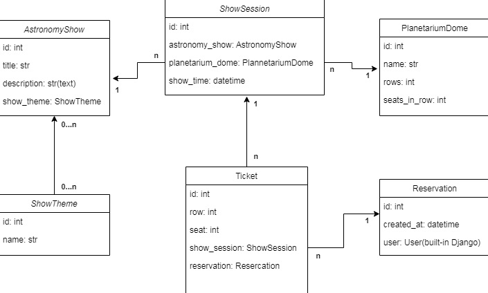

# PLANETARIUM API SERVICE

Django Rest project for reservation tickets to visit astronomy show in planetarium session 

# Planetarium api service can be downloaded from
[Planetarium APi Service from git hub](https://github.com/sasha-semenenko/planetarium-api-service/tree/develop)

# Installation

```shell
git clone https://github.com/sasha-semenenko/planetarium-api-service.git
cd planetarium-api-service
python3 -m venv venv
venv\Scripts\activate
pip install -r requirements.txt
```

Fill .env file with data according to .env_sample file

```shell
python manage.py migrate
python manage.py runserver 
```

# How to run with Docker
Docker must be already installed!
* Fill .env file with your data according to .env_sample file
```shell
docker-compose up build
```
* Create user's
* Create/get JWT-token and authorization
* Use planetarium-api-service-application

# Project Schema


# Swagger schema endpoints

